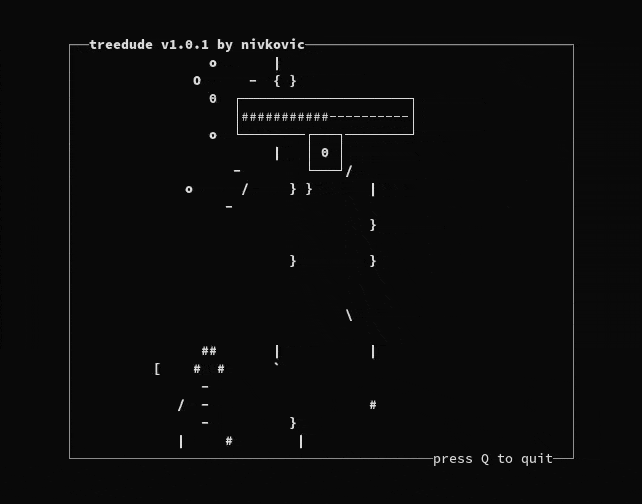

# treedude

treedude is a clone of [the mini-game from Superhot titled 'Tree Dude Tree Dude Dude'](https://superhot.fandom.com/wiki/Tree_Dude). Chop as much of the tree as you can while avoiding branches and keeping an eye on the timer.

Written in C89/90 with the Curses library and complies with [SUSv2](https://pubs.opengroup.org/onlinepubs/007908799/) through to [POSIX.1-2008 (SUSv4)](https://pubs.opengroup.org/onlinepubs/9699919799/).



## Installation

Ensure the following is available on your system:
* GCC or clang. To use clang, `CC=clang` must be passed to make commands.
* An [X/Open Curses](https://pubs.opengroup.org/onlinepubs/7908799/xcurses/curses.h.html) implementation such as ncurses or PDCurses.

Clone and build:
(Replace `github.com` with `gitlab.com` if using GitLab)
```
$ git clone https://github.com/n-ivkovic/treedude
$ cd treedude
$ make
```

Run without installing:
```
$ ./treedude
```

Install and run:
```
# make install
$ treedude
```

Update after installation:
```
$ git pull master
$ make
# make install
```

Additional options:
```
$ make help
```

## Usage

### Controls

| Key           | Action      |
| ---           | ---         |
| `←`, `A`, `H` | Chop left.  |
| `→`, `D`, `L` | Chop right. |
| `Enter`       | Continue.   |
| `Q`, `Esc`    | Quit.       |

### Options

| Option | Description |
| ---    | ---         |
| -n     | Do not read or write the high score from the `$XDG_DATA_HOME` (`$HOME`/.local/share) directory. |
| -v, -V | Print version and exit. |

## Wishlist

The below are features I may or may not get around to implementing:

* Windows support. This will need to include changing the build process, likely through the usage of CMake.
* Refactors and rewrites. This is my first notable C project, there are bound to be areas that need improvement.

## Contributing

Please adhere to the following when creating a pull request:

* Ensure changes do not cause the compiler to return any warnings or errors.
* Ensure changes are written in C89/90 that complies with [SUSv2](https://pubs.opengroup.org/onlinepubs/007908799/), but does not utilise features removed from or marked as obsolete in [POSIX.1-2001 (SUSv3)](https://pubs.opengroup.org/onlinepubs/000095399/) or [POSIX.1-2008 (SUSv4)](https://pubs.opengroup.org/onlinepubs/9699919799/). Features in standards newer than SUSv2 may be utilised as long as whether the feature can be utilised on the current system is checked during compile time and the game will still run fine if the feature cannot be utilised.
* Ensure changes match the general coding style of the project.
* Ensure changes are branched from `develop` and the pull request merges back into `develop`.

## Licence

Copyright © 2022 Nicholas Ivkovic.

Licensed under the GNU General Public License version 3 or later. See [./LICENSE](./LICENSE), or [https://gnu.org/licenses/gpl.html](https://gnu.org/licenses/gpl.html) if more recent, for details.

This is free software: you are free to change and redistribute it. There is NO WARRANTY, to the extent permitted by law.
